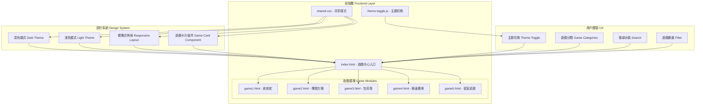
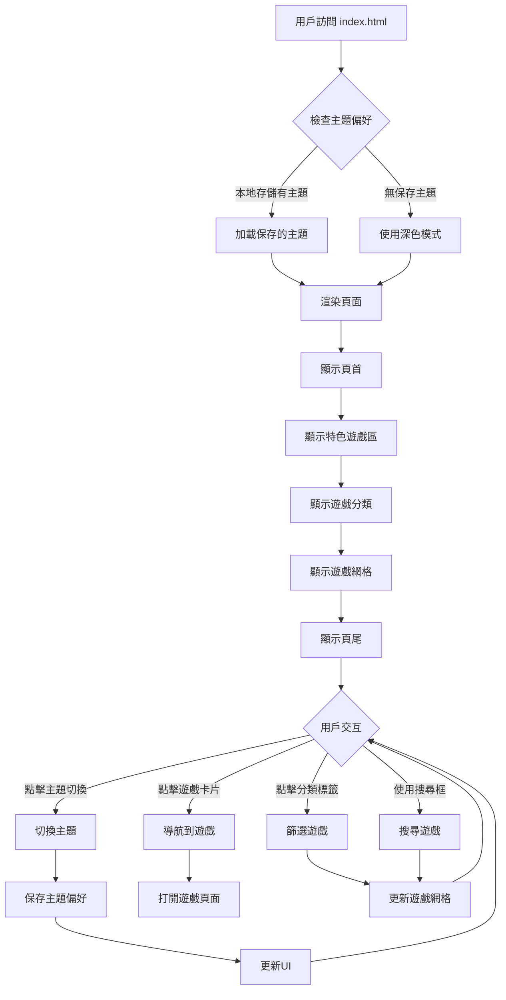
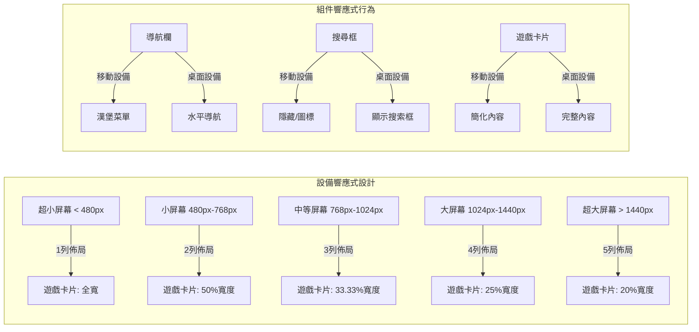
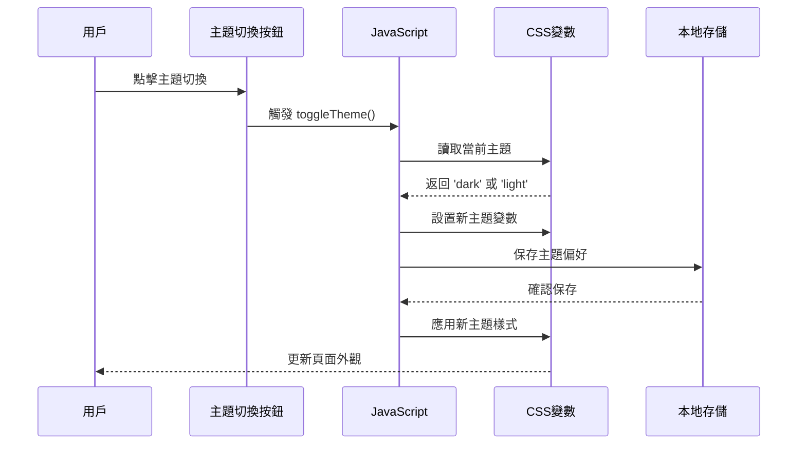
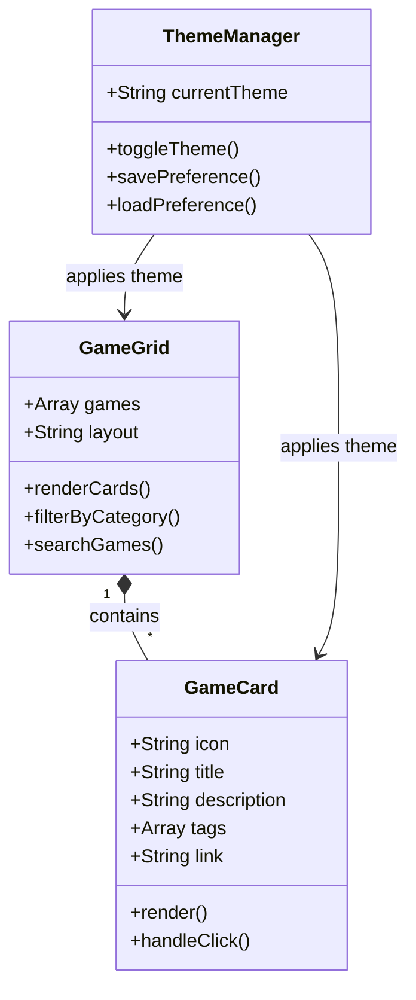
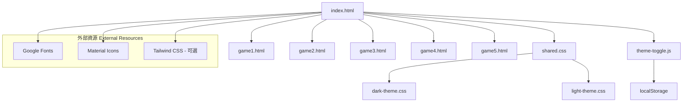
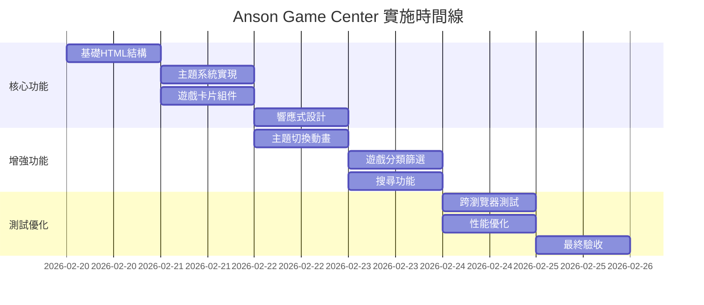

# Anson Game Center 系統架構圖

## 系統架構概覽

## 頁面結構流程圖

## 響應式設計斷點

## 主題切換機制

## 遊戲卡片組件結構

## 文件依賴關係

## 實施優先級

## 技術決策點

1. **CSS 框架選擇**
   - 選項 A: 純 CSS + 自定義變數
   - 選項 B: Tailwind CSS (現有主題使用)
   - 推薦: 使用現有 Tailwind CSS 配置保持一致性

2. **主題存儲策略**
   - 選項 A: localStorage
   - 選項 B: cookies
   - 選項 C: 服務器端存儲
   - 推薦: localStorage (簡單有效)

3. **響應式斷點**
   - 基於現有遊戲的斷點設計
   - 保持一致的用户體驗

4. **瀏覽器兼容性**
   - 目標: Chrome, Firefox, Safari, Edge
   - 最低支援: ES6, CSS Grid, Flexbox